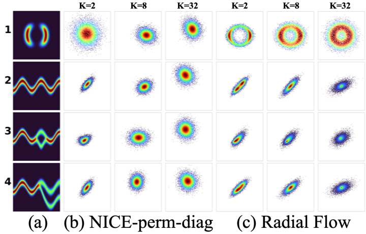
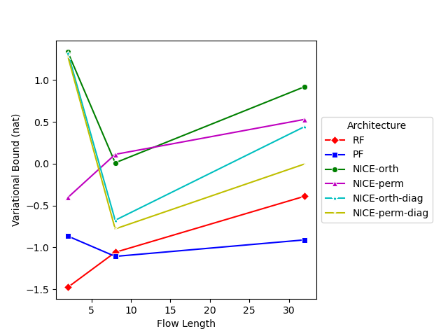
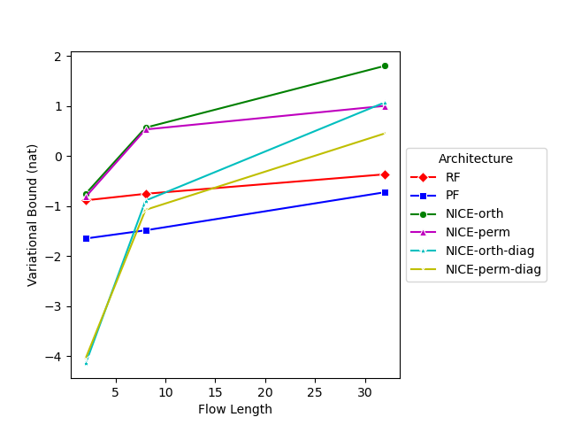
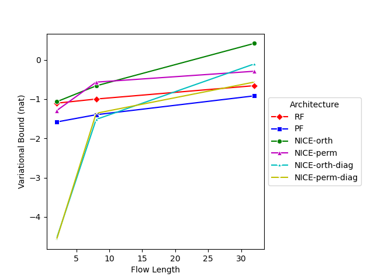
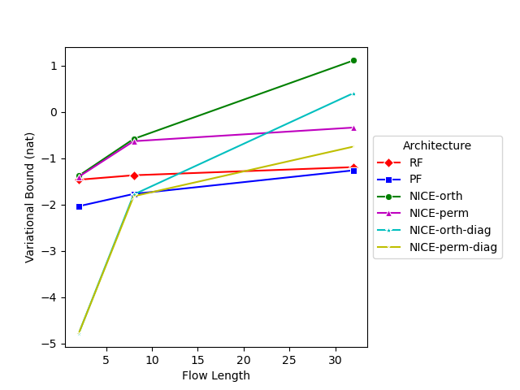
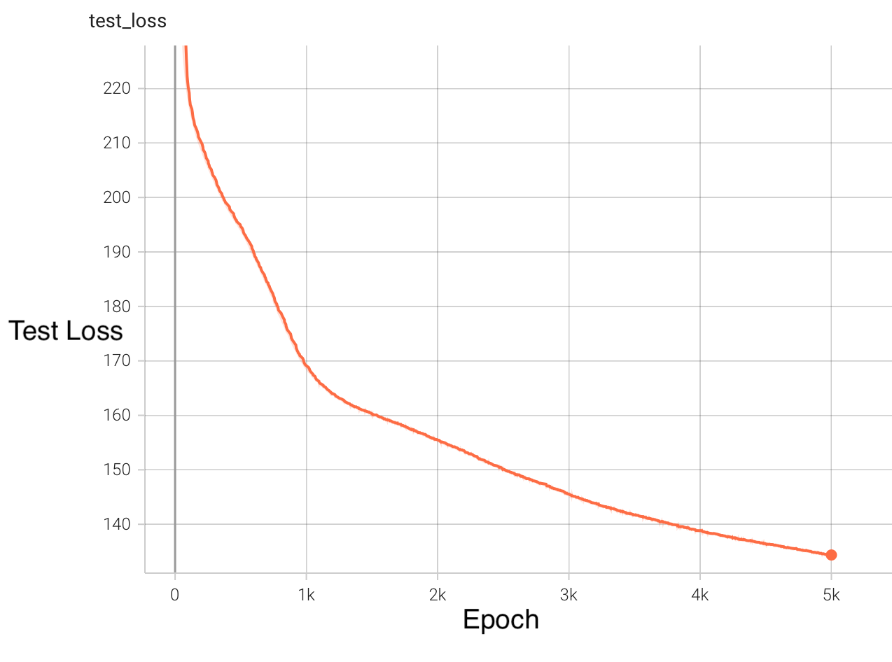

# Variational Inference with Normalizing Flows

## Description

Reproduction of [Variational Inference with Normalizing Flows][1], including radial flows, [NICE][2]-orthogonal and [NICE][2]-permutation. We repeat the first experiement of density estimation with variational inference, and compare the results with the results of the original paper. We also extend the paper by impelmenting [circular convolution flows][3] and evaluating it with the second experiment of density estimation on MNIST.

More details can be found in our [report](./report/report.pdf) or [poster](./poster/poster.pdf).

## Training & Evaluation

To start, create a new conda environment from ``environment.yml``.

To train models for experiment 1, run ``python experiments/one.py`` from this directory (the same is true for other instructions).

To plot the results, run ``python experiments/one_eval.py``.

To see how flows transform the distribution, run ``python experiments/one_plot.py``.

To train models for experiment 1, run ``python experiments/two.py``.

## Results

We were only able to obtain results for all models for the first experiment due to time and resource constraints. We present the losses from training against distributions 1-4 (see first picture) as follows:

For the second experiment, we have the following results for circular convolution flows:

## References

[1][1]: Jimenez Rezende, D., & Mohamed, S. (2015). Variational Inference with Normalizing Flows. ICML.

[2][2]: Dinh, L., Krueger, D., & Bengio, Y. (2015). NICE: Non-linear Independent Components Estimation. CoRR, abs/1410.8516.

[3][3]: Karami, M., Schuurmans, D., Sohl-Dickstein, J., Dinh, L., & Duckworth, D. (2019). Invertible Convolutional Flow. NeurIPS.

[1]: https://arxiv.org/pdf/1505.05770.pdf
[2]: https://arxiv.org/pdf/1410.8516.pdf
[3]: https://proceedings.neurips.cc/paper/2019/file/b1f62fa99de9f27a048344d55c5ef7a6-Paper.pdf
